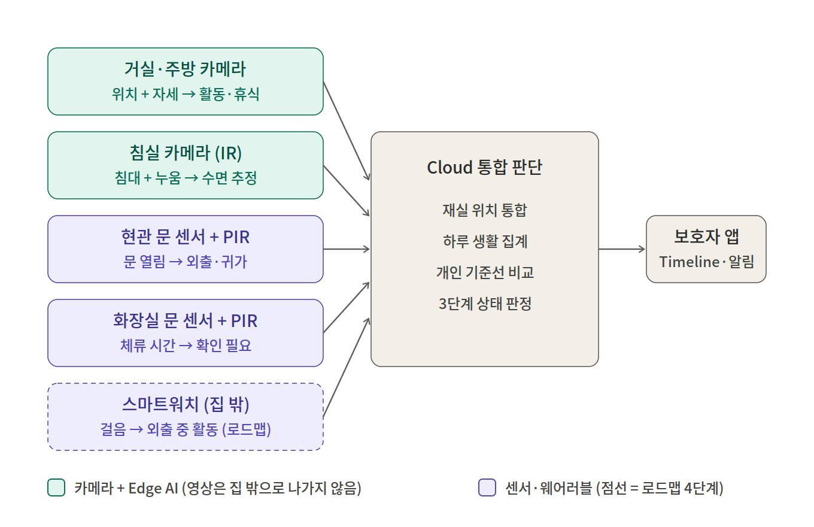

# 별일없지 — Physical AI 생활안심 시스템 PRD

> 문서 버전 **v1.2** · 작성일 2026-10-07
> Word 버전: [PRD_v1.2.docx](PRD_v1.2.docx) · 관련 문서: [Vision 전처리·후처리 설계](../report/vision-preprocessing-design.md)

> 본 문서는 **제품 기준 PRD**이며, 최종 목표 구조와 단계별 로드맵을 함께 정의합니다. 4주 개인 PoC는 로드맵의 **1단계(거실·주방 카메라 + 앱 연동)**만 검증합니다(5.3 참고).
> 주요 출력(행동)은 **보호자 앱의 상태·Timeline 표시와 푸시 알림**입니다.

## 변경 이력

| 버전 | 날짜 | 주요 변경 |
|---|---|---|
| v1.0 | 2026-10-06 | 최초 작성 |
| v1.1 | 2026-10-07 | 최종 목표 구조 추가(공간별 장치 배치, Cloud 재실 위치 통합), 카메라 판단을 "위치(Zone) + 자세" 두 축으로 재정의, 주방 활동·식탁 체류 추가, 스마트워치를 선택 장치로 추가, 공통 이벤트 형식 정의, 4단계 로드맵으로 범위 재구성 |
| v1.2 | 2026-10-07 | 작성 과정에서 가정으로 추가했던 내용 정리: 야간 동선 조명 제어 삭제, 페르소나 세부 설정(나이·보호자 신상) 삭제, 돌봄 기관·생활지원사는 ROI 도입 가정과 로드맵의 운영자 대시보드로 한정. 스마트워치를 집 밖 케어 장치(로드맵 4단계)로 정리하고 원칙을 "집 안은 착용 없이, 집 밖은 워치로"로 변경 |

---

## 1. 문제 정의 (Problem Statement)

### 1.1 현재 문제

- 독거 고령자 가구는 사고가 없는 날에도 "평소처럼 생활하고 있는지"를 가족이나 돌봄 인력이 확인할 수단이 부족합니다.
- 확인은 주로 안부 전화와 정기 방문에 의존합니다. 그래서 확인 빈도는 사람의 시간에 묶여 있고, 확인과 확인 사이의 공백은 그대로 남습니다.
- 위험은 사고 순간보다 그 전의 **생활 리듬 변화**로 먼저 나타나는 경우가 많습니다. 예를 들어 늦은 기상, 아침 주방 활동의 부재, 활동 감소, 야간 화장실 장시간 체류 같은 신호입니다. 그런데 지금은 이런 변화를 기록하고 비교하는 체계가 없습니다.

### 1.2 기존 방식의 한계

| 방식 | 한계 |
|---|---|
| 안부 전화·방문 | 인력과 시간에 비례해 비용 증가, 확인 사이 공백 발생 |
| 실내 CCTV | 원본 영상 상시 노출로 사생활 침해, 고령자 거부감, 보호자가 직접 영상을 봐야 함 |
| PIR 단독 센서 | "08:31 움직임"만 기록. 어느 공간에서 무엇을 하는지(휴식·주방 활동·수면·외출) 구분하지 못함 |
| 웨어러블 단독 | 착용·충전을 고령자에게 요구. 미착용 시 무용지물이며 집 안 생활은 거의 알 수 없음 |

### 1.3 핵심 가치

> **"고령자는 평소처럼 생활하고, 기술은 뒤에서 조용히 안전을 보조한다."**

- **집 안은 착용 없이, 집 밖은 워치로:** 집 안 판단은 착용·버튼·앱 조작 없이 동작합니다. 카메라와 센서가 닿지 않는 집 밖은 스마트워치가 담당합니다(로드맵 4단계). 워치를 차지 않은 날에도 집 안 판단과 현관 센서 기반 외출 추정은 그대로 동작합니다.
- **영상 대신 생활 신호:** 보호자에게는 "07:42 주방에서 활동이 확인됐어요" 같은 의미 단위 이벤트만 전달합니다.
- **공간별 프라이버시 수준에 맞는 장치:** 화장실에는 카메라를 두지 않고, 침실 영상도 집 밖으로 보내지 않습니다.
- **평소 대비 변화 감지:** 개인별 기준선과 비교해 "확인이 필요한 날"만 알립니다.
- **확정 진단 금지:** "식사를 안 했습니다", "낙상했습니다" 대신 "확인이 필요한 변화가 있어요"로 표현합니다.

### 1.4 왜 AI가 필요한가

- PIR은 움직임 유무만 알고, **어느 구역(주방·거실·식탁·소파·침대)에서 어떤 자세(서기·앉기·눕기)로 있는지 구분하지 못합니다.** 이 두 축을 함께 알아야 휴식, 주방 활동, 수면 추정 같은 생활 신호를 만들 수 있고, 이를 위해 카메라 기반 사람 검출과 Pose 추정이 필요합니다.
- 프라이버시를 지키려면 영상을 사람이 보는 대신 **기계가 현장에서 해석하고 폐기해야** 합니다. 이 해석 단계가 곧 Edge AI의 역할입니다.
- 여러 장치의 신호를 합쳐 "지금 어디에 있는가"를 하나로 정하는 통합 판단과, 사람마다 다른 생활 리듬을 반영하는 개인별 기준선이 필요합니다.

---

## 2. 사용자 시나리오 (User Scenario)

### 2.1 사용자

- **피보호자:** 김영희 님, 혼자 사시는 부모님. 거실과 주방이 트인 구조의 집
- **보호자:** 멀리 떨어져 사는 자녀

### 2.2 최종 목표 구조

| 공간 | 장치 | 판단 근거 | 생성 신호 (예) |
|---|---|---|---|
| 거실·주방 | Edge 카메라 #1 | 위치(Zone) + 자세 + 체류 시간 | 활동, 휴식(소파), 주방 활동, 식탁 체류, 시야 밖 |
| 침실 | Edge 카메라 #2 (IR) | 침대 Zone + 누운 자세 + 장시간 낮은 움직임 | 침대 휴식(수면 추정), 야간 침대 이탈 |
| 현관 | 문 센서 + PIR | 문 열림 + 이후 집 안 활동 없음 | 외출 추정, 귀가 추정 |
| 화장실 | 문 센서 + PIR (카메라 미설치) | 입실·퇴실, 체류 시간 | 장시간 체류 → 확인 필요 |
| 집 밖 | 스마트워치 (로드맵 4단계) | 걸음 수, 착용 여부 | 외출 중 활동 확인, 귀가 지연 |

### 2.3 단계별 흐름

| 단계 | 내용 |
|---|---|
| **1. 설치** | 장치를 설치하고, 앱에서 카메라 화면을 **설치 시 1회만** 보며 바닥 기준 Zone(주방·거실·식탁·소파·침대)을 다각형으로 지정하고, TV·거울 같은 오검출 영역을 제외 영역으로 지정합니다. 이후 영상 보기 기능은 비활성화됩니다. 피보호자와 보호자는 서면 동의서에 서명합니다. |
| **2. 데이터 수집** | 카메라는 5~10 FPS로 프레임을 Edge 장치 메모리에서만 처리하고 즉시 폐기합니다. ESP32 센서는 문 열림·움직임 이벤트와 10분 주기 heartbeat를 보냅니다. 스마트워치는 외출 중 걸음 수를 주기적으로 동기화합니다(착용 시). |
| **3. 분석** | **Edge:** 사람 검출 → 사람 영역 crop → Pose 추정 → 발 위치(발목 중간점, 가려지면 엉덩이 기준 보정)로 Zone 판정 → 자세 분류 → 체류 시간·히스테리시스 적용. **Cloud:** 장치별 이벤트를 합쳐 "지금 어디에 있는가"를 하나로 정하는 재실 위치 통합, 하루 집계, 최근 14일 개인 기준선(첫 활동 시각, 아침 주방 활동 시각, 오전 활동 시간, 야간 화장실 횟수 등) 비교를 수행합니다. |
| **4. 판단 결과 생성** | 상태 전환 시점에만 공통 형식의 이벤트를 생성합니다. 예: 07:42~07:58 주방 활동, 08:05~08:30 식탁 체류, 23:10~06:35 침대 휴식, 09:30 외출 추정. 하루 상태는 NORMAL / CHECK / EMERGENCY 중 하나로 판정합니다. "카메라 시야 밖"은 외출로 판정하지 않으며, 외출은 현관 센서가 근거일 때만 추정합니다. |
| **5. 사용자 알림** | ① CHECK 전환 시 보호자에게 FCM 푸시를 보냅니다. ② 화장실 체류가 기준을 넘거나 바닥에 누운 상태가 지속되면 EMERGENCY 후보로 보고, 10분 집계를 기다리지 않고 보호자에게 바로 알립니다. ③ 평소와 같은 날에는 푸시 없이 앱에만 조용히 표시합니다. |
| **6. 결과 확인·후속 행동** | 보호자는 앱 Timeline에서 "평소 아침 7시대에 있던 주방 활동이 오늘은 아직 확인되지 않았어요"를 보고 전화합니다. 평소와 같은 날에는 "오늘도 별일 없어요"와 하루 Timeline만 확인합니다. |

### 2.4 공통 이벤트 형식

모든 장치는 같은 형식으로 이벤트를 보냅니다. 장치가 늘어나도 Cloud 통합 판단과 앱 표시를 다시 설계하지 않기 위해서입니다.

| 필드 | 설명 | 예 |
|---|---|---|
| `location` | 발생 공간·Zone | kitchen, living_sofa, dining_table, bedroom_bed, entrance, bathroom, outside |
| `state` | 자세·활동 상태 | active, rest, kitchen_activity, table_stay, bed_rest, not_in_view, away, prolonged_stay |
| `startedAt` / `endedAt` | 구간의 시작·종료 시각 (시점 이벤트는 동일 값) | 2026-10-07T07:42 / 07:58 |
| `confidence` | 판단 신뢰도 (0~1) | 0.82 |
| `source` | 출처 장치 ID와 종류 | edge-cam-living / EDGE_VISION |

---

## 3. 성공 지표 (Success Metrics)

### 3.1 AI 인식 성능

| KPI | 목표 | 측정 방법 |
|---|---|---|
| 위치(Zone) 판정 정확도 (주방 / 거실 / 식탁 / 소파) | ≥ 90% (구간 기준) | 라벨링된 시나리오 영상 대비 |
| 자세 분류 정확도 (서기·이동 / 앉음 / 누움) | ≥ 90% | 라벨링된 시나리오 영상 대비 |
| 주방 활동 구간 검출 재현율 | ≥ 90% | 주방 활동 일지 대조 (14일) |
| 침대 휴식 추정 재현율 | ≥ 90% | 수면 일지와 대조 (14일) |
| 침대 휴식 시작·종료 시각 오차 | ±10분 이내 | 수면 일지 대조 |
| 바닥 누운 상태 검출 재현율 | ≥ 95% | 연출 시나리오 50회 |
| 바닥 누운 상태 오검출 | 가구당 월 ≤ 1회 | 실가구 파일럿 로그 |
| 외출·귀가 추정 정확도 | ≥ 95% | 현관 센서 + 집 안 활동 결합, 외출 일지 대조 |
| 상태 떨림 (1분 미만 왕복 전환) | 시간당 ≤ 1회 | Edge 로그 |

### 3.2 시스템 성능

| KPI | 목표 |
|---|---|
| Edge 추론 처리 속도 | ≥ 5 FPS (Raspberry Pi 5 기준) (가정) |
| 상태 전환 → 보호자 앱 반영 | ≤ 60초 |
| EMERGENCY 후보 → 푸시 수신 | ≤ 60초 (10분 Cron을 기다리지 않는 즉시 경로) |
| 장치 가동률 | ≥ 99% (월간) |
| 외부 전송 데이터 중 이미지·영상 | **0건** (네트워크 감사 로그) |

### 3.3 서비스·비즈니스

| KPI | 목표 |
|---|---|
| CHECK 알림 중 보호자 "확인 필요했음" 응답 비율 | ≥ 60% |
| 가구당 주간 오알림 | ≤ 1회 |
| 생활지원사 정기 안부 확인 시간 (ROI 도입 가정) | 50% 감소 (가정) |
| 보호자 주간 앱 확인 | 가구당 주 3회 이상 |
| 피보호자 서비스 유지율 (6개월) | ≥ 85% |

---

## 4. 기술 스택 (Technology Stack)

| 구성 | 사용 기술 | 선정 이유 |
|---|---|---|
| 카메라 (거실·주방) | USB UVC 웹캠 1080p 광각 | 저가, 드라이버 호환성 높음. 트인 거실·주방을 한 화면에 담기 위해 광각 사용 |
| 카메라 (침실) | Raspberry Pi Camera Module 3 NoIR + 850nm IR LED (가정) | 야간 저조도에서 일반 RGB 카메라는 Pose 추정이 사실상 불가하므로 IR 필요 |
| 센서 | HC-SR501 PIR, MC-38 마그네틱 도어 센서 | 현관·화장실은 카메라 없이 출입과 체류 판단 가능. 저가이며 검증된 부품 |
| 웨어러블 (로드맵 4단계) | 스마트워치 (예: Galaxy Watch). 1차: Android Health Connect로 걸음 수 연동, 2차: 자체 Wear OS 앱 검토 | 집 밖 활동 신호 담당. 실시간 위치 대신 외출 시간·걸음 활동만 사용하고, 집 안 판단은 워치 없이 동작하도록 설계 |
| MCU | ESP32-S3 | Wi-Fi 내장, 기존 PIR 펌웨어와 heartbeat 구조를 재사용 |
| Edge AI 장치 | Raspberry Pi 5 (8GB) (가정) | 산업 PoC에서 많이 쓰는 ARM SBC. Python·OpenCV·ONNX 생태계 지원 |
| 사람 검출 | YOLO nano급 모델 (ONNX Runtime) | 경량, 사전학습 person 클래스 바로 사용. ⚠️ Ultralytics YOLO는 AGPL-3.0이므로 상용 시 기업 라이선스 필요 |
| 자세 추정 | MediaPipe Pose (사람 영역 crop 후 적용) | CPU 실시간 동작, 별도 학습 불필요. 광각 화면에서 작게 잡히는 사람의 관절 정확도를 crop으로 보완 |
| 위치 판정 | 다각형 Zone 설정 + 발 위치 판정 (OpenCV `pointPolygonTest`) | 고정 카메라에서는 설치 시 1회 지정한 Zone이 자동 공간 인식보다 정확하고 설명 가능 |
| 행동 판단 | 규칙 기반 상태 머신 (위치 + 자세 + 체류 시간 + 히스테리시스) | 학습 데이터 없이 동작하고, 판단 근거를 설명할 수 있음. 실데이터 축적 후 경량 분류기로 교체 검토 |
| 재실 위치 통합 | Cloud 상태 머신 (거실·주방 / 침실 / 화장실 / 외출 중 하나로 결정) | 여러 장치의 신호를 합쳐 "시야 밖"과 "외출"을 구분. 1인 가구 전제 |
| 생활패턴 분석 | 통계 기준선 (14일 이동 평균·표준편차) | 데이터가 적은 초기에 과적합 없이 동작. 6개월 이상 축적 후 이상탐지 모델 검토 |
| 서버 (Ingest·판정) | Cloudflare Workers + Cron Triggers | 기존 구현을 재사용. 서버 관리 부담 없음, 무료 구간이 넓음 |
| 통신 | Wi-Fi + HTTPS (JSON), 디바이스 키 인증 | 가정용 공유기 활용. 상태 전환 시에만 전송해 트래픽 최소화 |
| 데이터베이스 | Firebase Cloud Firestore | 기존 구현을 재사용. 실시간 구독(onSnapshot)으로 앱 즉시 반영 |
| 보호자 앱 | Expo React Native (Android 우선) | 기존 구현을 재사용. Home·Timeline UX 확보 |
| 운영자 대시보드 (돌봄 기관 도입 시) | React + Vite 웹 (Firebase Auth) | 담당 가구 상태 목록, CHECK 우선 정렬. 6장 ROI의 도입 가정에 해당 |
| 알림 | FCM HTTP v1 | 기존 구현을 재사용. Android 실기기 수신 검증 완료 |
| 보안 | Firebase Auth + guardianLinks + Firestore Security Rules | 기존 구현을 재사용. 연결된 보호자만 해당 가구 데이터 조회 |

> 전처리·후처리 파이프라인의 단계별 설계와 근거는 [Vision 전처리·후처리 설계](../report/vision-preprocessing-design.md)에 정리했습니다.

---

## 5. 개발 범위 / 비범위 (Scope)

### 5.1 개발 범위 (In Scope)

1. **실시간 사람 검출·자세 추정:** 거실·주방, 침실 카메라에서 Edge 온디바이스 추론
2. **Zone 기반 위치 판정:** 주방 / 거실 / 식탁 / 소파 / 침대, 발 위치 기준, 제외 영역(TV·거울) 처리
3. **위치 + 자세 조합 생활상태 판단:** 활동, 휴식, 주방 활동, 식탁 체류, 침대 휴식, 시야 밖, 바닥 누운 상태
4. **원본 영상 미저장·미전송:** 프레임 메모리 처리 후 폐기, 외부 전송은 이벤트 JSON만 허용
5. **공통 이벤트 형식:** 위치, 상태, 시작·종료 시각, 신뢰도, 출처 장치
6. **센서 기반 외출·귀가 추정:** 현관 문 센서 + 집 안 활동 결합 규칙
7. **화장실 장시간 체류 감지:** 문 센서 + PIR 결합, 체류 기준 초과 시 EMERGENCY 후보
8. **Cloud 재실 위치 통합:** 장치별 신호를 합쳐 현재 위치를 하나로 결정
9. **스마트워치 집 밖 활동 신호:** 외출 중 걸음 활동·착용 여부, 귀가 지연. 실시간 위치는 보여주지 않으며, 미착용은 위험으로 판단하지 않음
10. **개인 기준선 비교:** 14일 통계 기준선 대비 CHECK 판정
11. **보호자 앱 Timeline·상태 표시와 푸시 알림:** "추정" 표현 기반 문구, CHECK / EMERGENCY / 장치 오프라인
12. **운영자 웹 대시보드 (돌봄 기관 도입 시):** 가구 목록, 상태 필터, 최근 이벤트
13. **장치 헬스 모니터링·로그 저장:** heartbeat, 추론 FPS, 오류 로그

### 5.2 개발 제외 범위 (Out of Scope)

1. **낙상 순간 동작 인식:** 넘어지는 동작 자체를 시계열 모델로 분류하는 기능. "바닥에 누운 상태 지속"만 다룹니다.
2. **의료적 판단:** 수면의 질, 질병, 인지 저하 진단
3. **식사·복약 판정:** 식사 여부, 식사량, 복약 확인. 주방 활동·식탁 체류는 위치 신호로만 다룹니다.
4. **워치 건강 데이터·실시간 위치 추적:** 심박수·혈중 산소 등 생체 신호 기반 판단, 보호자용 실시간 위치·이동 경로 표시, 워치 미착용을 위험 신호로 보는 판단
5. **자동 공간 인식:** AI가 방 구조를 스스로 인식하는 기능. Zone은 설치 시 사람이 지정합니다.
6. **얼굴 인식·신원 식별 및 다중 인물 구분:** 1인 가구를 전제로 합니다.
7. **보호자용 실시간·녹화 영상 보기**
8. **화장실 카메라 및 mmWave 레이더:** 화장실은 센서 방식만 사용합니다.
9. **119 자동 신고 및 외부 기관 연동**
10. **iOS 앱, 다국어 지원, Cloud 기반 모델 재학습 파이프라인**

### 5.3 단계별 로드맵

| 단계 | 범위 | 산출물 |
|---|---|---|
| **1단계 (4주 PoC)** | 거실·주방 카메라: 위치 + 자세 → 활동, 휴식, 주방 활동, 식탁 체류, 시야 밖. 공통 이벤트 형식으로 기존 Worker·앱 Timeline 연동 | Edge 파이프라인, KPI 측정 결과, 앱 Timeline 데모 |
| **2단계** | 침실 카메라: 같은 파이프라인에 침대 Zone과 침대 휴식 규칙 추가, IR 야간 대응 | 수면 추정 이벤트, 야간 조도 검증 |
| **3단계** | 현관·화장실 센서(기존 ESP32 파이프라인 재사용) + Cloud 재실 위치 통합 | 외출·귀가 추정, 장시간 체류 알림, 통합 상태 머신 |
| **4단계** | 스마트워치 연동(집 밖: Health Connect 걸음 수 → 자체 Wear OS 앱), 개인 기준선 비교, 운영자 대시보드(돌봄 기관 도입 시) | 집 밖 활동 신호, CHECK 고도화, 파일럿 준비 |

> **1단계 Go/No-Go:** Zone 판정이 주방 조리대 가림 때문에 KPI에 도달하지 못하면, 엉덩이 기준 보정과 카메라 위치 재조정을 먼저 시도하고 그래도 부족하면 "주방 활동"을 "주방 Zone 체류"로 낮춰 표현합니다.

---

## 6. ROI 분석 (Business Value)

### 6.1 전제 (가정)

- **고객:** 지자체 노인맞춤돌봄 수행기관 (B2G/B2B)
- **현재 업무:** 생활지원사가 가구당 월 4시간을 정기 안부 확인(전화·방문)에 사용
- **도입 효과:** 이상 신호 기반 우선순위 확인으로 정기 확인 시간 50% 감소, 불필요 방문 가구당 월 1회 감소
- **인건비:** 시간당 16,000원 / 방문 1회 이동 비용·시간 20,000원
- **가구당 H/W:** Edge 2대 360,000원 + ESP32 센서 4세트 40,000원 + 설치비 50,000원 = **450,000원**
- **스마트워치는 이용자 보유 기기를 활용하는 선택 장치로 보고 H/W 비용에서 제외**
- **AI 초기 개발비는 1~2단계(카메라 파이프라인) 기준이며, 3~4단계(Cloud 재실 위치 통합, 워치 연동) 개발비는 별도 예산으로 미포함**
- **사고 조기 발견에 따른 손실 감소 효과는 정량화가 어려워 보수적으로 제외**

### 6.2 시나리오 A — 파일럿 100가구

| 항목 | 산출 근거 | 금액 (원) |
|---|---|---|
| **초기 투자비 (CAPEX)** | | **106,000,000** |
| └ H/W 도입비 | 450,000 × 100가구 | 45,000,000 |
| └ AI 모델 초기 개발비 | Vision 파이프라인·규칙 엔진, 2인 × 2개월 | 40,000,000 |
| └ 앱·서버·대시보드 고도화 | 기존 시스템 확장 | 15,000,000 |
| └ 라이선스 | YOLO 상용 라이선스 등 (가정) | 6,000,000 |
| **월 절감액 (Gross Benefit)** | | **5,200,000** |
| └ 인건비 절감 | 2시간 × 100가구 × 16,000 | 3,200,000 |
| └ 방문 감소 | 1회 × 100가구 × 20,000 | 2,000,000 |
| **월 운영비 (OPEX)** | | **2,850,000** |
| └ Edge 전력비 | 7W × 2대 × 720h × 150원/kWh × 100가구 | 150,000 |
| └ Cloud·API 비용 | Firestore·Workers·FCM | 200,000 |
| └ 유지보수 | 장애 대응·현장 A/S 0.5 FTE | 2,000,000 |
| └ 규칙 튜닝·모델 업데이트 공수 | 월 3일 | 500,000 |
| **월 순 절감액 (Net Benefit)** | 5,200,000 − 2,850,000 | **2,350,000** |
| **연간 ROI** | 28,200,000 ÷ 106,000,000 × 100 | **26.6%** |
| **투자 회수기간** | 106,000,000 ÷ 2,350,000 | **약 45.1개월** |

### 6.3 시나리오 B — 확산 500가구

| 항목 | 산출 근거 | 금액 (원) |
|---|---|---|
| **초기 투자비 (CAPEX)** | H/W 225,000,000 + 개발 40,000,000 + 고도화 15,000,000 + 라이선스 6,000,000 | **286,000,000** |
| **월 절감액** | 5,200,000 × 5 | **26,000,000** |
| **월 운영비** | 전력 750,000 + Cloud 600,000 + 유지보수 1 FTE 4,000,000 + 튜닝 500,000 | **5,850,000** |
| **월 순 절감액** | 26,000,000 − 5,850,000 | **20,150,000** |
| **연간 ROI** | 241,800,000 ÷ 286,000,000 × 100 | **84.5%** |
| **투자 회수기간** | 286,000,000 ÷ 20,150,000 | **약 14.2개월** |

### 6.4 최종 판정

> **판정: 조건부 GO**
>
> - **100가구 파일럿 단독으로는 회수기간이 약 45개월(3.8년)로 사업성이 약합니다.** 초기 AI 개발비가 적은 가구 수에 집중되기 때문입니다. 파일럿의 목적은 수익이 아니라 **KPI 검증**(오알림 가구당 주 1회 이하, 정기 확인 시간 50% 감소)으로 정의해야 합니다.
> - **500가구 이상에서 회수기간이 약 14개월로 줄어 사업성이 성립합니다.** 개발비는 고정이고 절감액은 가구 수에 비례하기 때문입니다.
> - **가장 민감한 가정은 "정기 확인 시간 50% 감소"입니다.** 이 값이 25%로 떨어지면 시나리오 B의 월 순 절감액은 약 1,220만 원으로 줄고, 회수기간은 약 23개월로 늘어납니다. 파일럿에서 이 수치를 가장 먼저 실측해야 합니다.
> - **3~4단계 개발비는 위 수치에 포함되지 않았습니다.** 해당 단계 착수 전에 범위를 확정하고 ROI를 다시 산정해야 합니다.
> - 하드웨어 원가 절감(Edge 2대 → 1대 + 침실 저가 장치)이 확산 단계의 다음 개선 과제입니다.
